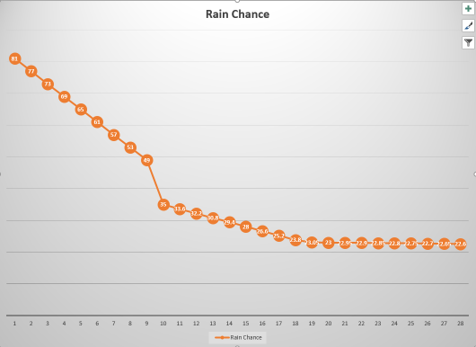
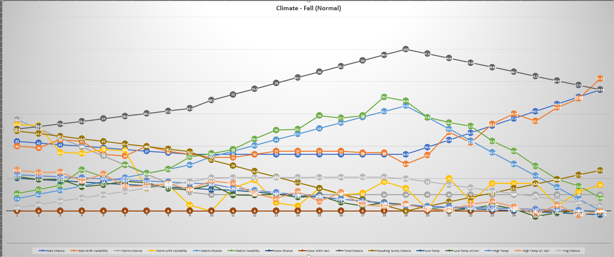
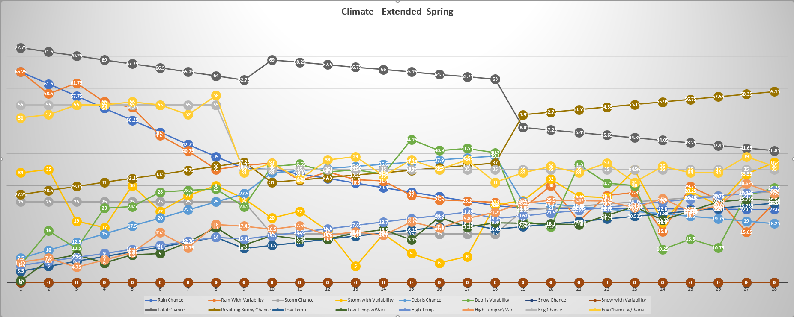

# Climate Writeup

This is a writeup of how it determines weather per day. This will cover default climates and at the end, how to write your own.

## Engine 

This mod works by normalizing the odds to ensure they always total 1 and then assigning space to them. 

For example, if the debris chance to day is .25, and the rain chance today is .15, then the chances are calculated to be:

>0 <= x < 15 Rain
>
>15 <= x < 40 Debris

And then, you can derive:

>40 <= x < 100 Sunny.

As such, the sunny odds are always derived rather than stated.

It is possible that certain weathers are not allowed in seasons, and this is determined by if the weather has more than 0% chance.  (A detailed writeup of that is at the end.) An example might be a Extended Winter day, for example:

>0 <= x < 5 Rain
>
>5 <= x < 65 Snow
>
>65 <= x < 75 Debris

which derives
>75 <= x < 100 Sunny

but a normal Winter day would be
> 0 <= x < 65 Snow 
> 
> 65 <= x < 100 Sunny.

Bear in mind, however, that all default climates apply a variability to this, meaning that odds will often be less or more than assumed, and that the odds often will sum over or under 1. 

### Climate Formulae

In an effort to avoid having people deal with trigonometry, rather than the equation: `y = Asin(2pifx) + B`, this mod uses a partwise standard slope equation series of segments. In other words, you can define a rate of change based on the day of the month and an initial value for spans of the season. An example is:

This will result in: 

It is somewhat advised when creating a custom climate to think about what you want. It is possible to specify only one segment per season, and to use a flat rate as well. 

### Normal Climate

Loosely based off of Seattle, springs under this climate are initially wet but dry off rapidly. Storm chances are relatively flat but increase towards the end of the month, as the wind driven off the Gem Sea picks up before going slack again. 

#### Spring

Rain starts at 81% and rapidly drops to 35% on Day 10, where it drops slower (to 23% on Day 20) before remaining flat at those odds for the rest of the month. Storms vary between 15-30% chance all month, and it is extremely windy in the middle part of the season. This means that the best times for sun are in the end of the season. Temperatures start cold (~3C) but increase to ~26C by the end of the month. Lows can differ as much as 10C towards the end.

##### Formulas - Day 1 to 9

* Rain: `f(x) = .85 - day*.04`
* Rain Variability: `±.04`
* Storm: `.25`
* Storm Variability: `±.1`
* Debris: `f(x) = .05 + day*.025`
* Debris Variability: `±.08`
* Snow: `0`
* Snow Variability: `0`
* Low Temperature: `f(x) = 2 + day*1.5`
* Low Temperature Variability: `±3`
* High Temperature: `f(x) = 4 + day*1.25`(clamp so that it's always higher than low)
* High Temperature Variability: `±4`(clamp so that it's always higher than low)
* Fog Chance: `.55`
* Fog Variability: `±.04`
 
#### Formulas - Day 10 to 19

* Rain: `f(x) = .49 - day*.014`
* Rain Variability: `±.02`
* Storm: `.15`
* Storm Variability: `±.1`
* Debris: `f(x) = .275 + day*.0065`
* Debris Variability: `±.08`
* Snow: `0`
* Snow Variability: `0`
* Low Temperature: `f(x) = 2 + day*.95`
* Low Temperature Variability: `±3`
* High Temperature: `f(x) = 4 + day*1.05`(clamp so that it's always higher than low)
* High Temperature Variability: `±4`(clamp so that it's always higher than low)
* Fog Chance: `.35`
* Fog Variability: `±.04`

#### Formulas - Day 20 to 28

* Rain: `f(x) = .24 - day*.0005`
* Rain Variability: `±.07`
* Storm: `f(x) = .10 + day*.0065`
* Storm Variability: `±.1`
* Debris: `f(x) = .3925 - day*.0075`
* Debris Variability: `±.14`
* Snow: `0`
* Snow Variability: `0`
* Low Temperature: `f(x) = 2 + day*.805`
* Low Temperature Variability: `±3`
* High Temperature: `f(x) = 4 + day*.875`(clamp so that it's always higher than low)
* High Temperature Variability: `±4`(clamp so that it's always higher than low)
* Fog Chance: `.35`
* Fog Variability: `±.04`

#### Summer

While very dry at the beginning of the season (~20%), it increases slowly until a sudden sharp increase to ~45% at the end of the month. Summers in Stardew Valley are known for being overwhelmingly sunny, with a very good chance of storms if it does rain in the middle of the month. Due to the very flat winds, summers are also rather humid and hot, with temperatures staying a minimum of 23C, but as warm as 32C or more in the middle of it. Lows hover at 5 to 8 degrees below the high.

##### Formulas - Day 1 to 9

* Rain: `f(x) = .20 - day*.001`
* Rain Variability: `±.04`
* Storm: `.4`
* Storm Variability: `±.1`
* Debris: `0`
* Debris Variability: `0`
* Snow: `0`
* Snow Variability: `0`
* Low Temperature: `f(x) = 24 + day*.1`
* Low Temperature Variability: `±3`
* High Temperature: `f(x) = 28 + day*.82`(clamp so that it's always higher than low)
* High Temperature Variability: `±4`(clamp so that it's always higher than low)
* Fog Chance: `.001`
* Fog Variability: `±.04`
 
#### Formulas - Day 10 to 18

* Rain: `f(x) = .20 - day*.0001`
* Rain Variability: `±.02`
* Storm: `.8`
* Storm Variability: `±.1`
* Debris: `0`
* Debris Variability: `0`
* Snow: `0`
* Snow Variability: `0`
* Low Temperature: `f(x) = 24 - day*.01`
* Low Temperature Variability: `±3`
* High Temperature: `f(x) = 28 + day*.62`(clamp so that it's always higher than low)
* High Temperature Variability: `±4`(clamp so that it's always higher than low)
* Fog Chance: `.001`
* Fog Variability: `±.04`

#### Formulas - Day 19 to 28

* Rain: `f(x) = -.12 + day*.0183`
* Rain Variability: `±.07`
* Storm: `f(x) = .80 - day*.0065`
* Storm Variability: `±.1`
* Debris: `0`
* Debris Variability: `0`
* Snow: `0`
* Snow Variability: `0`
* Low Temperature: `f(x) = 27 - day*.25`
* Low Temperature Variability: `±3`
* High Temperature: `f(x) = 57 - day*1.25`(clamp so that it's always higher than low)
* High Temperature Variability: `±4`(clamp so that it's always higher than low)
* Fog Chance: `.001`
* Fog Variability: `±.04`

#### Fall

Rain odds stay flat with minor variances at 45% for the first half of fall before increasing to ~60% by the end of the season. Fall is mostly known for it's wind, and there's almost no day without wind or rain later in the season. The temperatures are cooling rapidly, sometimes with early frosts near the end of the season due to lows.

##### Formulas - Day 1 to 9

* Rain: `f(x) = .44 - day*.001`
* Rain Variability: `±.04`
* Storm: `.62 - (day *.056)` 
* Storm Variability: `±.1`
* Debris: `f(x)= .05 + (day*.026)`
* Debris Variability: `+.1`
* Snow: `0`
* Snow Variability: `0`
* Low Temperature: `f(x) = 21 - day*.78`
* Low Temperature Variability: `±3`
* High Temperature: `f(x) = 23 - day*.64`(clamp so that it's always higher than low)
* High Temperature Variability: `±4`(clamp so that it's always higher than low)
* Fog Chance: `.001 + day*.02`
* Fog Variability:  `±.04`

##### Formulas - Day 10 to 19

* Rain: `f(x) = .35`
* Rain Variability: `±.02`
* Storm: `.1`
* Storm Variability: `±.1`
* Debris: `f(x) = .3 +(day*.035)`
* Debris Variability: `+.1`
* Snow: `0`
* Snow Variability: `0`
* Low Temperature: `f(x) = 25 - day*1.11`
* Low Temperature Variability: `±3`
* High Temperature: `f(x) = 29 - day*1.3522`(clamp so that it's always higher than low)
* High Temperature Variability: `±4`(clamp so that it's always higher than low)
* Fog Chance: `.20 + day*.05`
* Fog Variability:  `±.04`

##### Formulas - Day 20 to 28

* Rain: `f(x) = .494 + (day * .0444)`
* Rain Variability: `±.07`
* Storm: `.1`
* Storm Variability: `±.1`
* Debris: `f(x) = 2.0222 -(day*.0722)`
* Debris Variability: `+.1`
* Snow: `0`
* Snow Variability: `0`
* Low Temperature: `f(x) = 25 - day*1.11`
* Low Temperature Variability: `±3`
* High Temperature: `f(x) = 29 - day*1.3522`(clamp so that it's always higher than low)
* High Temperature Variability: `±4`(clamp so that it's always higher than low)
* Fog Chance: `.55 - day*1.85`
* Fog Variability:  `±.04`

#### Winter

Winters are often at -1 to -4 C, mediated somewhat by the Gem Sea. However, the jetstream often brings water, to the point where the valley can often receive several feet of snow over the season with snow odds being a high 85% throughout the entire winter. 

##### Formulas - Day 1 to 9

* Rain: `f(x) = .75`
* Rain Variability: `±.04`
* Storm: `0`
* Storm Variability: `0`
* Debris: `0`
* Debris Variability: `0`
* Snow: `1`
* Snow Variability: `0`
* Low Temperature: `f(x) = -2.5 - day*.05`
* Low Temperature Variability: `±3`
* High Temperature: `f(x) = - day*.1579`(clamp so that it's always higher than low)
* High Temperature Variability: `-4`(clamp so that it's always higher than low)
* Fog Chance: `.03 + day*.0051`
* Fog Variability:  `±.04`

##### Formulas - Day 10 to 18

* Rain: `f(x) = .75 - (day *.0045)`
* Rain Variability: `±.02`
* Storm: `0`
* Storm Variability: `0`
* Debris: `0`
* Debris Variability: `0`
* Snow: `1`
* Snow Variability: `0`
* Low Temperature: `f(x) = 25 - day*1.11`
* Low Temperature Variability: `±3`
* High Temperature: `f(x) = 29-(day*1.3522)`(clamp so that it's always higher than low)
* High Temperature Variability: `-4`(clamp so that it's always higher than low)
* Fog Chance: `-.20 + (day*.028)`
* Fog Variability:  `±.04`

##### Formulas - Day 19 to 28

* Rain: `f(x) = .58 + (day * .006)`
* Rain Variability: `±.07`
* Storm: `0`
* Storm Variability: `0`
* Debris: `0`
* Debris Variability: `0`
* Snow: `1`
* Snow Variability: `0`
* Low Temperature: `f(x) = -24+day`
* Low Temperature Variability: `±3`
* High Temperature: `f(x) = -(day*.1579)`(clamp so that it's always higher than low)
* High Temperature Variability: `±4`(clamp so that it's always higher than low)
* Fog Chance: `-.20 + (day*.028)`
* Fog Variability:  `±.04`

### Enhanced Climate

This differs only in that allows several weathers the base game does not. These changes occur only in Fall and Winter.

### Spring

Rain odds fall from 65% instead of 81%. 

##### Formulas - Day 1 to 9

* Rain: `f(x) = .69 - day*.0375` 
* Rain Variability: `±.04`
* Storm: `.25`
* Storm Variability: `±.1`
* Debris: `f(x) = .05 + day*.025`
* Debris Variability: `±.08`
* Snow: `0`
* Snow Variability: `0`
* Low Temperature: `f(x) = 2 + day*1.5`
* Low Temperature Variability: `±3`
* High Temperature: `f(x) = 4 + day*1.25`(clamp so that it's always higher than low)
* High Temperature Variability: `±4`(clamp so that it's always higher than low)
* Fog Chance: `.55`
* Fog Variability: `±.04`
 
#### Formulas - Day 10 to 19

* Rain: `f(x) = .49 - day*.014`
* Rain Variability: `±.02`
* Storm: `.15`
* Storm Variability: `±.1`
* Debris: `f(x) = .275 + day*.0065`
* Debris Variability: `±.08`
* Snow: `0`
* Snow Variability: `0`
* Low Temperature: `f(x) = 2 + day*.95`
* Low Temperature Variability: `±3`
* High Temperature: `f(x) = 4 + day*1.05`(clamp so that it's always higher than low)
* High Temperature Variability: `±4`(clamp so that it's always higher than low)
* Fog Chance: `.35`
* Fog Variability: `±.04`

#### Formulas - Day 20 to 28

* Rain: `f(x) = .24 - day*.0005`
* Rain Variability: `±.07`
* Storm: `f(x) = .10 + day*.0065`
* Storm Variability: `±.1`
* Debris: `f(x) = .3925 - day*.0075`
* Debris Variability: `±.14`
* Snow: `0`
* Snow Variability: `0`
* Low Temperature: `f(x) = 2 + day*.805`
* Low Temperature Variability: `±3`
* High Temperature: `f(x) = 4 + day*.875`(clamp so that it's always higher than low)
* High Temperature Variability: `±4`(clamp so that it's always higher than low)
* Fog Chance: `.35`
* Fog Variability: `±.04`

### Fall

It often dips below 2C in the end of the season, and as such, there are odds of snow instead of rain. **NB:** If Hazardous Weather is enabled, this **WILL** kill crops. 

##### Formulas - Day 1 to 9

* Rain: `f(x) = .44 - day*.001`
* Rain Variability: `±.04`
* Storm: `.62 - (day *.056)`
* Storm Variability: `±.1`
* Debris: `f(x)= .05 + (day*.026)`
* Debris Variability: `0`
* Snow: `0`
* Snow Variability: `0`
* Low Temperature: `f(x) = 21 - day*.78`
* Low Temperature Variability: `±3`
* High Temperature: `f(x) = 23 - day*.64`(clamp so that it's always higher than low)
* High Temperature Variability: `±4`(clamp so that it's always higher than low)
* Fog Chance: `.01 + day*.02`
* Fog Variability:  `±.04`

##### Formulas - Day 10 to 19

* Rain: `f(x) = .35`
* Rain Variability: `±.02`
* Storm: `.1`
* Storm Variability: `±.1`
* Debris: `f(x) = .3 +(day*.035)`
* Debris Variability: `+.1`
* Snow: `0`
* Snow Variability: `0`
* Low Temperature: `f(x) = 25 - day*1.11`
* Low Temperature Variability: `±3`
* High Temperature: `f(x) = 29 - day*1.3522`(clamp so that it's always higher than low)
* High Temperature Variability: `±4`(clamp so that it's always higher than low)
* Fog Chance: `.20 + day*.05`
* Fog Variability:  `±.04`

##### Formulas - Day 20 to 28

* Rain: `f(x) = -.494 + (day * .0424)`
* Rain Variability: `±.07`
* Storm: `.1`
* Storm Variability: `±.1`
* Debris: `f(x) = 1.4932 -(day*.044)`
* Debris Variability: `+.1`
* Snow: `.15`
* Snow Variability: `0`
* Low Temperature: `f(x) = 15.75 - day*0.65017`
* Low Temperature Variability: `±3`
* High Temperature: `f(x) = 10 - day*.358`(clamp so that it's always higher than low)
* High Temperature Variability: `±4`(clamp so that it's always higher than low)
* Fog Chance: `.55 - day*1.85`
* Fog Variability:  `±.04`

### Winter

The most changed season, this reintroduces wind (which looks like small snowflakes), decreases snow odds to add in more wind, and may have some rain at the end of the season, rather than snow. Also rare chances of thundersnow (something like 5%).

##### Formulas - Day 1 to 9

* Rain: `f(x) = .65`
* Rain Variability: `±.04`
* Storm: `.1-(day*.005)`
* Storm Variability: `±.1`
* Debris: `f(x)=  .2 + (day*.014)`
* Debris Variability: `+.1`
* Snow: `1`
* Snow Variability: `0`
* Low Temperature: `f(x) = -2.5 - day*.05`
* Low Temperature Variability: `±3`
* High Temperature: `f(x) = - day*.1579`(clamp so that it's always higher than low)
* High Temperature Variability: `-4`(clamp so that it's always higher than low)
* Fog Chance: `.03 + day*.0051`
* Fog Variability:  `±.04`

##### Formulas - Day 10 to 18

* Rain: `f(x) = .74 - (day *.006)`
* Rain Variability: `±.02`
* Storm: `.05`
* Storm Variability: `±.1`
* Debris: `f(x)=.44-(day*.012)`
* Debris Variability: `+.1`
* Snow: `1`
* Snow Variability: `0`
* Low Temperature: `f(x) = 25 - day*1.11`
* Low Temperature Variability: `±3`
* High Temperature: `f(x) = 29-(day*1.3522)`(clamp so that it's always higher than low)
* High Temperature Variability: `-4`(clamp so that it's always higher than low)
* Fog Chance: `-.20 + (day*.028)`
* Fog Variability:  `±.04`

##### Formulas - Day 19 to 28

* Rain: `f(x) = .52 + (day * .0065)`
* Rain Variability: `±.07`
* Storm: `=-.17+(day*.012)`
* Storm Variability: `±.1`
* Debris: `f(x)= 50 - (day*1.4)`
* Debris Variability: `+.1`
* Snow: `1`
* Snow Variability: `0`
* Low Temperature: `f(x) = -24+day`
* Low Temperature Variability: `±3`
* High Temperature: `f(x) = -(day*.1579)`(clamp so that it's always higher than low)
* High Temperature Variability: `±4`(clamp so that it's always higher than low)
* Fog Chance: `-.20 + (day*.028)`
* Fog Variability:  `±.04` 